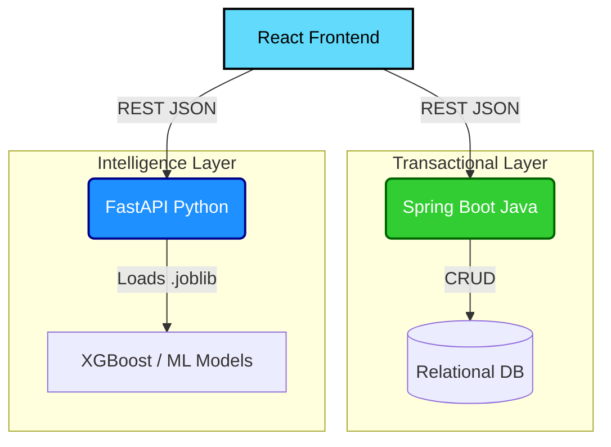

# 🏥 HospitalIQ — Enterprise Healthcare Intelligence Platform

HospitalIQ is an AI-powered hospital capacity and patient risk management system built on a **Dual-Backend Microservice Architecture**. It predicts bed shortages, forecasts pandemic spread scenarios, and analyzes patient health data in real-time.

---

## 🏗️ Architecture Overview

The system uses a highly scalable dual-backend approach to cleanly separate transactional data from computationally heavy Machine Learning workloads.



### 1. Spring Boot 3 (Data Service)
*   **Role:** Handles all high-throughput transactional operations (CRUD).
*   **Design:** Strict Controller-Service-Repository pattern with DTO mapping.
*   **Security:** Stateless JWT authentication with Spring Security `anyRequest().authenticated()` enforcing defense-in-depth authorization.
*   **Database:** In-memory H2 (for development) or SQLite via Spring Data JPA.

### 2. FastAPI (Machine Learning Service)
*   **Role:** Serves ML predictions and complex data aggregation.
*   **Why Python?:** Native integration with Pandas, Scikit-Learn, and XGBoost.
*   **Performance:** Uses Python's `asyncio` for non-blocking I/O. ML models are pre-loaded into memory during the application `lifespan` context, avoiding expensive disk reads on every request.

---

## 🚀 Key Features
*   **📈 Bed Availability Forecasting:** Predicts future ICU and general bed shortages using an XGBoost time-series model (with lag features and rolling means).
*   **🦠 Pandemic Scenario Engine:** Simulates outbreak trajectories based on R₀ models and dynamic mutation factors.
*   **🛡️ Patient Risk Stratification:** Analyzes medical histories (vaccines, pre-existing conditions, travel) to generate automated risk scores.
*   **💬 AI Assistant:** Integrated chatbot for querying live hospital capacities.

---

## 💻 Tech Stack
*   **Frontend:** React 18, Vite, TypeScript, Tailwind CSS, Recharts (for complex data visualization).
*   **Java Backend:** Java 17, Spring Boot 3.2, Spring Security, Spring Data JPA, H2 Database.
*   **Python Backend:** Python 3.11, FastAPI, Uvicorn, Pandas, XGBoost, Scikit-Learn.
*   **Testing:** JUnit 5 / MockMvc (Java), Pytest (Python).

---

## 🛠️ Local Development Setup

### Prerequisites
*   Java 17+
*   Python 3.11+
*   Node.js 18+

### 1. Start the Spring Boot Backend (Port 8081)
```bash
cd patient-service
./mvnw spring-boot:run
```
*(The H2 database will automatically initialize and seed dummy patient data).*

### 2. Start the FastAPI Machine Learning Backend (Port 8000)
```bash
cd backend
python -m venv venv
source venv/bin/activate  # Or `venv\Scripts\activate` on Windows
pip install -r requirements.txt
python main.py
```
*(ML `.joblib` models will be loaded into RAM during startup).*

### 3. Start the React Frontend (Port 8510)
```bash
cd frontend
npm install
npm run dev
```

---

## 📡 API Endpoints Summary

### Spring Boot (`http://localhost:8081`)
| Method | Endpoint | Description | Auth |
| :--- | :--- | :--- | :--- |
| `GET` | `/api/v1/patients` | Paginated list of patients | 🔒 JWT |
| `GET` | `/api/v1/patients/{id}` | Detailed medical history | 🔒 JWT |
| `GET` | `/api/v1/health-stats` | Aggregated population stats | Public |

### FastAPI (`http://localhost:8000`)
| Method | Endpoint | Description | Auth |
| :--- | :--- | :--- | :--- |
| `POST` | `/api/predict/beds` | 10-year XGBoost bed forecast | 🔒 JWT |
| `POST` | `/api/predict/mortality` | Death rate predictions | 🔒 JWT |
| `GET` | `/api/pandemic/scenario` | Outbreak simulation models | 🔒 JWT |

---

## 🔮 Future Improvements (Roadmap)
*   **Dockerization:** Provide `Dockerfile` and `docker-compose.yml` for unified 1-click deployment.
*   **Spring Cloud Contract:** Implement consumer-driven contract testing between the Spring Boot and FastAPI services.
*   **Caching Layer:** Introduce Redis to replace the `AtomicReference` caching strategy in Spring Boot.
*   **Database Migration:** Replace `spring.jpa.hibernate.ddl-auto=update` with Flyway or Liquibase scripts.
